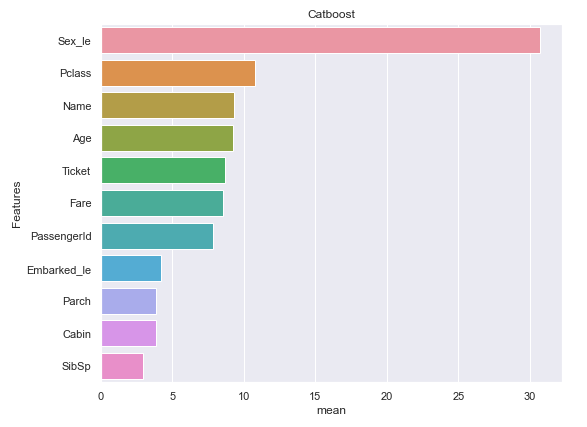
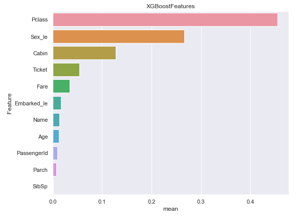

# Titanic data set

In the jupyter notebook **Titanic_survival_feature_importance.ipynb** we use titanic dataset available at [Kaggle Titanic competition](https://www.kaggle.com/c/titanic) to make a predictive model for survival of passengers. 

## Objective

My main focus in this notebook has been selecting the important features. I have checked how different algorithms including XGBoost, LightGBM and Catboost together with different feature selection techniques work. My feature selection techniques are RFE (Recursive Feature Elimination), mean of feature importances of each algorithm in 5-fold cross-validation and permutation feature selection.

## Process

1. We first looked into the dataset to get a sense of each feature. Target value in train data set is "Survived".
2. Encode categorical features with label and one-hot encodings. In selecting the features for one-hot encoding I chose only categorical variables with at most 3 not-null values. All other features have been label encoded.
3. I used XGBoost and RFE (Recursive Feature Elimination) to find the most important features.

**Note 1: Name and PassengerId are bad features that normally should be eliminated before start training a model. As my goal is to check how well different algorithms can select features, I did not drop any of them from the training data set. I left it to the algorithm and feature selection method to decide what features are important. **

**Note 2: On one condition name can have an impact on survival rate and that is if there is some type of racism going on that reduces the chance of let's say minorities to survive. We will check this if it plays a role. This is one of my hypothesis that has been checked in the notebook.**
4. As one-hot encoding creates more features, it makes redundancy. For instances male sex together with PClass were considered as two most important features in XGBoost with RFE. This led me to a hypothesis that being male would impact surviving, while survival is less sensitive to being female. Later on when I checked I understood 74% of female passengers survive on average, while for males it was only 18%.

5. Later on I applied label encoding to all categorical features and checked XGBoost, Lightgbm and Catboost on all of them.

# Result

1. XGBoost was the best in finding important features.
2. LightGBM performed poorly (very low accuracy) and found the worst features as important. The reason can be lightgbm requires large number of data while our training data set only had 891 records. This is one reason LightGBM worked poorly even after data cleaning by droping PassengerId, Name and Ticket.
3. Catboost alone didn't work well. But by droping poor features from the training data set and taking mean of feature importances of Catboost in 5-fold cross-validation it became considerably better. As you can see below, catboost has chosen name as an important feature which is truely wrong. Name however has correlation with sex, and sex is an important feature. It may be a reason.

4. Aplying different methods for feature selection to the same algorithm may cause different set of features as it was the case with catboost. Also it may change the order of important features. For instance applying RFE on XGBoost resulted in Sex, PClass and Cabin, while using 5-fold crossvalidation resulted in the order PClass, Sex and Cabin.

